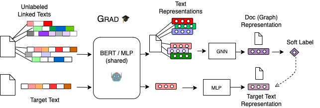

## GRAD: Graph-Aware Distillation on Textual Graphs
This is the code for reproducing key results for GraD: Graph-Aware Distillation on Textual Graphs.

<p align="center">
    
</p>

## Get Started
Please go to `GradBERT` or `GradMLP` for more instructions.

The dependencies to run the code are in `requirements.txt` file.

## Requirement and Install
We also follow the installation process from [[GIANT]](https://github.com/amzn/pecos/tree/mainline/examples/giant-xrt).

First let's setup a conda enviroment
```bash
conda create -n "grad" python=3.8
conda activate grad
```
Next, we install pytorch and libpecos:
```bash
conda install pytorch==1.9.0 cudatoolkit=10.2 -c pytorch
pip install libpecos==0.2.2
# check the pytorch version and cuda availability
python -c "import torch; print('torch={}, cuda={}'.format(torch.__version__, torch.cuda.is_available()))"
```
Finall, we install GNN related packages
```bash
ptcu_version="1.9.0+cu102"
pip install torch-scatter -f "https://pytorch-geometric.com/whl/torch-${ptcu_version}.html"
pip install torch-sparse -f "https://pytorch-geometric.com/whl/torch-${ptcu_version}.html"
pip install torch-cluster -f "https://pytorch-geometric.com/whl/torch-${ptcu_version}.html"
pip install torch-spline-conv -f "https://pytorch-geometric.com/whl/torch-${ptcu_version}.html"
pip install torch-geometric
pip install ogb==1.3.2
# our ogb version is 1.3.2
python -c "import ogb; from ogb.graphproppred import PygGraphPropPredDataset; print(ogb.__version__)"
```


## GradBERT embeddings

Please download the pre-trained GradBERT node embeddings from this link https://drive.google.com/drive/folders/1tol67YewYOGUSF4T2qwrdS-hBHBg-iCX?usp=sharing and extract them in this folder. Please make sure that the extracted folder has this substrucutre `GradBERT/embeddings/ogbn-*/`.

Then, you can go `ogbn-arxiv` or `ogbn-products` folder and run the corresponding `sh` commands to reproduce GradBERT results for the OGB leaderboard. 


## Directory Layout
Below you can find the scripts to reproduce the key results.

```bash
./GRAD
|---- GradBERT/                     # OGB datasets
|        |---- embeddings/
|        |---- ogbn-arxiv/ 
|        |        |---- gradbert_mlp.sh         # MLP with GradBERT feats
|        |        |---- gradbert_sage.sh        # SAGE with GradBERT feats
|        |        |---- RevGAT-ori
|                           |---- gradbert_RevGAT_ogbnarxiv.sh      # RevGAT with GradBERT feats
|        |---- ogbn-products/
|        |        |---- gradbert_mlp.sh         # MLP with GradBERT feats
|        |        |---- gradbert_giant_sage.sh  # SAGE with GradBERT+GIANT feats
|        |        |---- SAGN_with_SLE
|                           |---- Runexp_SAGN_SLE_ogbnproducts_morestages.sh     # SAGN_SLE with GradBERT+GIANT feats                    

|---- GradMLP/                # CPF data from GLNN
|        |---- experiments/          	
|        |        |---- cora_gradmlp.sh
|        |        |---- cora_gradmlp_kd.sh
|        |        |---- etc.


Please go to `GradBERT` or `GradMLP` for more details.